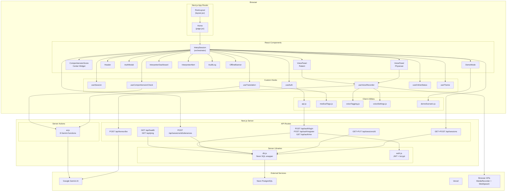
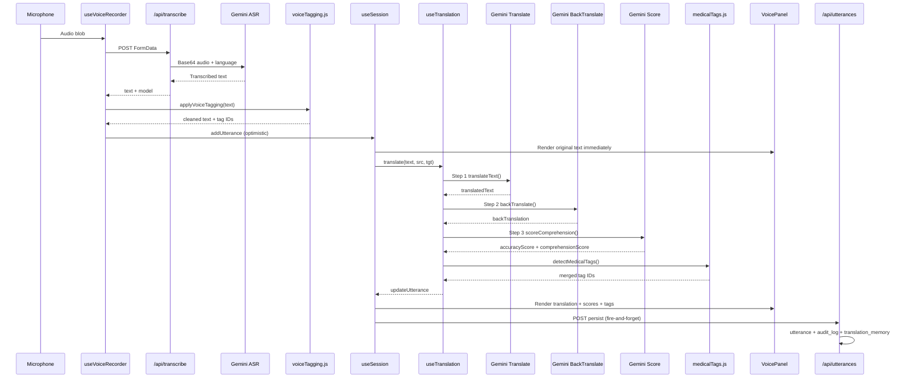
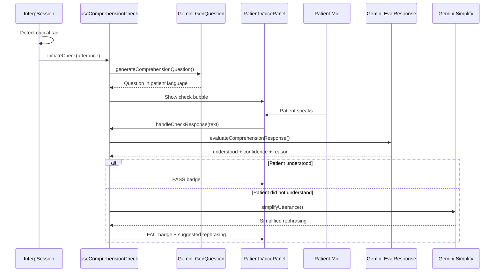
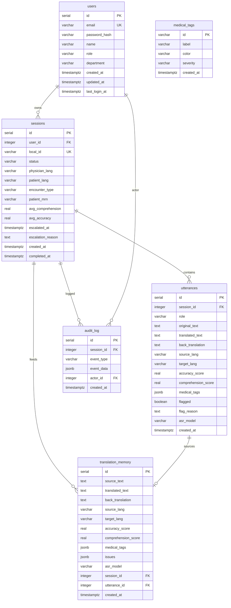

# Interp

**Human-verified AI medical interpretation in emergency departments.**

> Beyond translation, into interpretation.

Built with Next.js 16, React 19, Google Gemini AI, Neon PostgreSQL, and deployed on Vercel.

---

## System Architecture



---

## Core Translation Pipeline

Each utterance flows through a 3-step independent pipeline — **the AI never grades its own homework**. Translation, back-translation, and scoring are separate LLM calls so no single model can inflate its own confidence.



---

## Comprehension Check Flow

When a physician utterance contains a critical medical tag (`@consent`, `@surgical-risk`, `@procedure`), the system automatically generates a verification question in the patient's language and evaluates their response.



---

## Database Schema



---

## Key Components

| Component | File | Role |
|-----------|------|------|
| `InterpSession` | `src/components/InterpSession.jsx` | Main orchestrator — setup screen and chess board layout |
| `VoicePanel` | `src/components/VoicePanel.jsx` | One side of the board — mic button + scrolling transcript |
| `ComprehensionScore` | `src/components/ComprehensionScore.jsx` | Center widget — traffic-light accuracy/comprehension meters |
| `DemoMode` | `src/components/DemoMode.jsx` | Inject scripted utterances for live demos |
| `InterpreterDashboard` | `src/components/InterpreterDashboard.jsx` | Human interpreter correction panel |
| `InterpreterAlert` | `src/components/InterpreterAlert.jsx` | Escalation alert overlay |
| `AuditLog` | `src/components/AuditLog.jsx` | Compliance audit viewer |
| `AuthModal` | `src/components/AuthModal.jsx` | Login / register modal |

## Key Hooks

| Hook | File | Role |
|------|------|------|
| `useSession` | `src/hooks/useSession.js` | Session lifecycle (idle → active → paused → completed/escalated), utterance CRUD, running averages, escalation threshold |
| `useVoiceRecorder` | `src/hooks/useVoiceRecorder.js` | MediaRecorder + format detection, posts to `/api/transcribe`, applies voice tagging, WebSpeech fallback |
| `useTranslation` | `src/hooks/useTranslation.js` | 3-step independent pipeline: translate → back-translate → score. Detects medical tags on both source and translated text |
| `useComprehensionCheck` | `src/hooks/useComprehensionCheck.js` | COCO-style patient verification: generate question → evaluate response → simplify on failure |
| `useAuth` | `src/hooks/useAuth.jsx` | AuthContext provider with JWT token management |

## AI Pipeline (`src/utils/ai.js`)

All AI functions are Next.js server actions (`"use server"`) powered by Google Gemini.

| Function | Purpose |
|----------|---------|
| `translateText()` | Medical-grade translation preserving clinical meaning |
| `backTranslate()` | Independent reverse translation for verification |
| `scoreComprehension()` | Compares original vs back-translation, scores accuracy and comprehension |
| `transcribeAudio()` | Multimodal ASR via Gemini (base64 audio input) |
| `processVoiceTranscript()` | Clean up ASR output — fix stutters, preserve medical terms |
| `generateComprehensionQuestion()` | Generate verification question in patient's language |
| `evaluateComprehensionResponse()` | Evaluate whether patient understood the critical message |
| `simplifyUtterance()` | Rewrite medical statement in simpler language |

## File Structure

```
Interp/
├── app/
│   ├── layout.jsx                          # Root layout + AuthProvider
│   ├── page.jsx                            # Home → InterpSession
│   ├── globals.css
│   └── api/
│       ├── transcribe/route.js             # Gemini ASR endpoint
│       ├── sessions/
│       │   ├── route.js                    # List + create sessions
│       │   └── [id]/
│       │       ├── route.js                # Get + update session
│       │       └── utterances/route.js     # Persist utterance + audit + TM
│       ├── auth/
│       │   ├── login/route.js
│       │   ├── register/route.js
│       │   └── me/route.js
│       ├── health/route.js
│       └── ping/route.js
├── src/
│   ├── components/
│   │   ├── InterpSession.jsx + .css
│   │   ├── VoicePanel.jsx + .css
│   │   ├── ComprehensionScore.jsx + .css
│   │   ├── Header.jsx + .css
│   │   ├── AuthModal.jsx + .css
│   │   ├── DemoMode.jsx + .css
│   │   ├── InterpreterDashboard.jsx + .css
│   │   ├── InterpreterAlert.jsx + .css
│   │   ├── AuditLog.jsx + .css
│   │   └── OfflineBanner.jsx
│   ├── hooks/
│   │   ├── useSession.js
│   │   ├── useVoiceRecorder.js
│   │   ├── useTranslation.js
│   │   ├── useComprehensionCheck.js
│   │   ├── useAuth.jsx
│   │   ├── useOnlineStatus.js
│   │   └── useTheme.js
│   └── utils/
│       ├── ai.js                           # Server actions — all Gemini calls
│       ├── api.js                          # HTTP client + token management
│       ├── medicalTags.js                  # Keyword-based tag detection
│       ├── voiceTagging.js                 # Verbal command parser
│       ├── voiceSettings.js                # Voice model preferences
│       └── demoScenario.js                 # Scripted demo exchanges
├── lib/
│   ├── db.js                               # Neon PostgreSQL wrapper
│   └── auth.js                             # JWT + bcrypt + CORS
├── database/
│   ├── schema-neon.sql                     # Main schema (5 tables)
│   └── migration_translation_memory.sql    # Translation memory table
├── public/
│   ├── sw.js                               # Service worker (PWA)
│   └── manifest.json                       # PWA manifest
└── package.json
```

## Environment Variables

```
DATABASE_URL=       # Neon PostgreSQL connection string
JWT_SECRET=         # JWT signing key
GEMINI_API_KEY=     # Google Gemini AI API key
```

## Development

```bash
npm install
npm run dev
```

## Patent Pending

Combined AI + Human Interpreter Workflow — Patent Pending.
